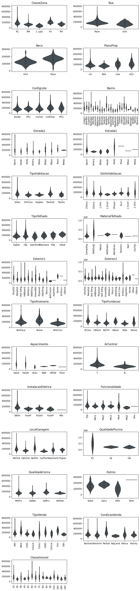
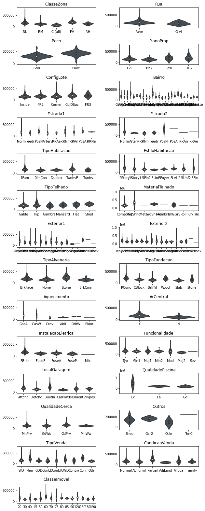
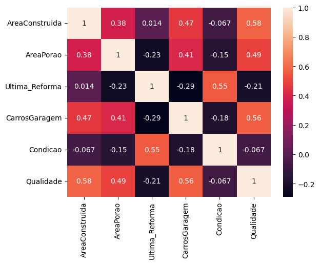
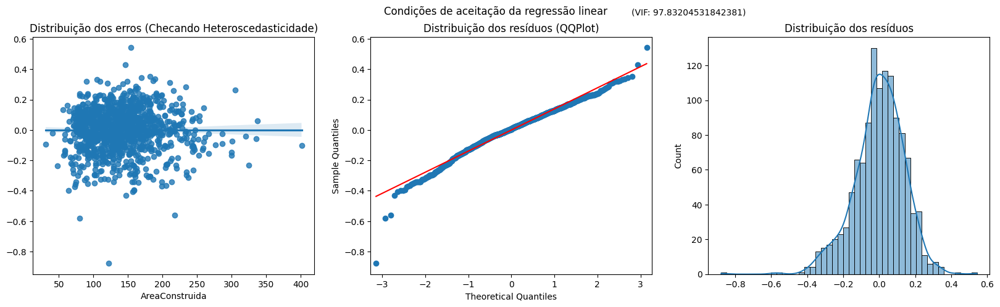
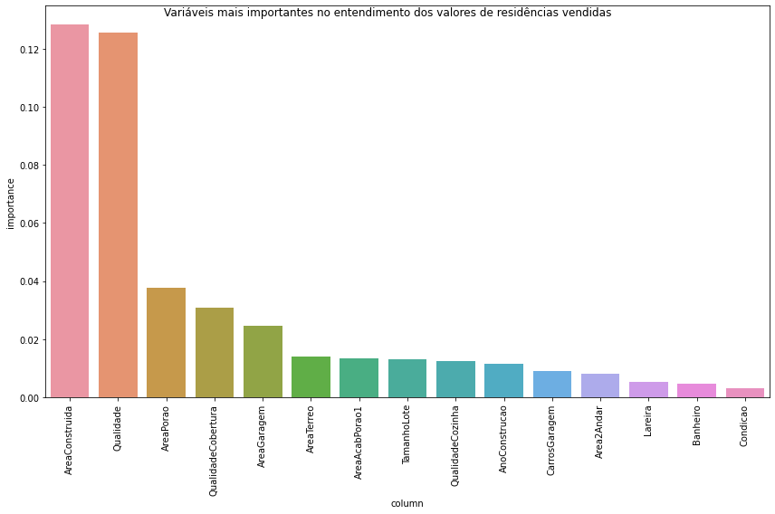

<h1>Tera - Desafio de interpretação e predição do valor de venda de imóveis</h1>

Esse código apresenta uma resolução para o desafio de regressão proposto pela Tera. O conjunto de dados descreve a venda de propriedades residenciais individuais de uma cidade americana, de 2006 a 2010. Ao todo são 2.930 observações e um grande número de features (23 nominais, 23 ordinais, 14 discretas e 20 contínuas) envolvidas na avaliação do valor dos imóveis, ou seja, são 80 variáveis explicativas.

O trabalho ao longo desse código foca, primeiro, em fazer uma análise exploratória dos dados e feature engeneering para organização ou manutenção das variáveis. Depois, são apresentadas leituras realizadas a partir da criação de um modelo de regressão linear e de um modelo de Machine Learning utilizando o algoritmo RandomForest.

Grandes agradecimentos à equipe da Tera, em especial ao expert Marcus Oliveira, que foi de grande ajuda na solução do problema.

<h2>1. Configurações iniciais</h2>

<h3>1.1 Importação das bibliotecas que serão utilizas ao longo do código</h3>


```python
#Core
import numpy as np
import pandas as pd
from typing import List, Tuple
import math

#Plot
import matplotlib.pyplot as plt 
import plotly.graph_objects as go
import plotly.express as px
from plotly.subplots import make_subplots
import seaborn as sns

from sklearn.model_selection import train_test_split 


#Estatística - Modelo de interpretação
from statsmodels.stats.outliers_influence import variance_inflation_factor
import statsmodels.api         as sm
import statsmodels.formula.api as smf

#Criação do modelo de Machine Learning
from sklearn.impute import SimpleImputer
from sklearn.feature_selection import SelectKBest
from sklearn.feature_selection import chi2, f_regression
from sklearn.preprocessing import OneHotEncoder
from sklearn.preprocessing import OrdinalEncoder
from sklearn.compose import make_column_transformer
from category_encoders.target_encoder import TargetEncoder
from sklearn.ensemble import RandomForestRegressor
from sklearn.metrics import mean_squared_error, r2_score, mean_absolute_percentage_error, mean_absolute_error
from sklearn.inspection import permutation_importance
```

<h3>1.2 Elaboração de algumas funções utilizadas posteriormente no código</h3>


```python
#Funções utilizadas ao longo do código


#Calcula o VIF para identificar multicolinearidade
def calc_vif(dataframe):
    vif = pd.DataFrame()
    vif['variables'] = dataframe.columns
    vif['VIF'] = [variance_inflation_factor(dataframe.values, i) for i in range(dataframe.shape[1])]
    return(vif)

def plot_vif(vif):
    print('vars: ', list(vif.columns))
    print('Variable Inflation Factors:', vif.VIF.sum(), '\n')

def train_test_valid_split(
    df: pd.DataFrame,
    features: list,
    target: str,
    test_size: float,
    valid_size: float,
    random_state: int,
) -> Tuple[np.array, np.array, np.array, np.array, np.array, np.array]:
    """Splits dataframe in training, testing and validation sets"""

    # The first train/test split
    (X_train, X_test, y_train, y_test) = train_test_split(
        df[features],
        df[target],
        test_size=test_size,
        random_state=random_state,
    )

    # The second train/test split
    (X_test, X_val, y_test, y_val) = train_test_split(
        X_test, y_test, test_size=valid_size, random_state=random_state
    )

    return X_train, X_test, X_val, y_train, y_test, y_val

def metrics_report(y, y_pred, dataset_name='valid'):
  mean_y = np.mean(y)
  mean_pred = np.mean(y_pred)

  rmse = round(math.sqrt(mean_squared_error(y, y_pred)), 2)
  mae = mean_absolute_error(y, y_pred)
  r2 = r2_score(y, y_pred)
  mape = mean_absolute_percentage_error(y, y_pred)
  
  report = pd.DataFrame({
    'metric': ['RMSE', 'MAE', 'R^2', 'MAPE', 'Avg. target', 'Avg. Prediction'],
    dataset_name: [rmse, mae, r2, mape, mean_y, mean_pred]
  })

  report[dataset_name] = report[dataset_name].round(2)
  return report


```


```python
#base original
base = pd.read_csv('base.csv', skipinitialspace=True)
```


    ---------------------------------------------------------------------------

    NameError                                 Traceback (most recent call last)

    Cell In[1], line 2
          1 #base original
    ----> 2 base = pd.read_csv('base.csv', skipinitialspace=True)
    

    NameError: name 'pd' is not defined


<h2>2. EDA da base original</h2>


```python
#Verificando as informações sobre nulos e tipo de cada coluna no dataframe
base.info(verbose=True)
```


    ---------------------------------------------------------------------------

    NameError                                 Traceback (most recent call last)

    ~\AppData\Local\Temp/ipykernel_2868/471892998.py in <module>
          1 #Verificando as informações sobre nulos e tipo de cada coluna no dataset
    ----> 2 base.info(verbose=True)
    

    NameError: name 'base' is not defined


<h4>2.1 Anotação da variável resposta e das features numéricas e categóricas (cardinais e ordinais)</h4>


```python
#Variável resposta
v_resposta = 'PrecoVenda'

#Lista das variáveis numéricas
v_numericos = base.select_dtypes(include=["int", "float"]).columns.to_list()
v_numericos.remove(v_resposta)
v_numericos.remove('ClasseImovel')

#Lista das variáveis categóricas
v_categoricas = base.select_dtypes(exclude=["int", "float"]).columns.to_list()
v_categoricas.append('ClasseImovel')

#Distinção das variáveis categóricas
cat_ordinal = ['FormaProp', 'Servicos', 'InclinacaoLote', 'Qualidade', 'Condicao', 'QualidadeCobertura', 'CondicaoExterna', 'AlturaPorao', 'CondicaoPorao', 'ParedePorao', 'TipoAcabPorao1', 'TipoAcabPorao2', 'QualidadeAquecimento', 'QualidadeCozinha', 'QualdiadeLareira', 'AcabamentoGaragem', 'QualidadeGaragem', 'CondicaoGaragem', 'EntradaPavimentada']

cat_cardinal = [x for x in v_categoricas if x not in cat_ordinal]

```

<h4>2.2 Entendendo a distribuição da variável resposta</h4>

A versão original da variável resposta é comparada a uma versão com tratamento logaritmico. Percebe-se que a variável em base logaritmica possui distribuição mais próxima à normal, logo, é a mais correta para o trabalho no modelo de interpretação por regressão linear


```python
#Criando uma variável com o log dos preços para verificar diferenças entre a distribuição da variável em forma comum e logarítimica 
base['logPrecoVenda'] = np.log(base['PrecoVenda'])

#Verificando graficamente a distribuição das variáveis
fig = make_subplots(rows= 2, cols=2, subplot_titles=["Distribuição da variável PrecoVenda", "Distribuição da variável logPrecoVenda", "Area Contruida x Preço de Venda", "Área construída x log Preço de Venda"])

fig.add_trace(go.Histogram(x = base['PrecoVenda']), row=1,col=1)
fig.add_trace(go.Histogram(x = base['logPrecoVenda']), row=1, col=2)
fig.add_trace(go.Scatter(x=base['PrecoVenda'], y=base['AreaConstruida'], mode='markers', showlegend=True), row=2, col=1)
fig.add_trace(go.Scatter(x=base['logPrecoVenda'], y=base['AreaConstruida'], mode='markers'), row=2, col=2)


fig.update_layout(width=1200, height=600)
fig.update_yaxes(title_text=('Teste1', 'Teste1', 'Teste1', 'Teste1'), row=(1,1,2,2), col=(1,2,1,2))
fig.show()


```


<h4>2.3 Variáveis categóricas: Examinando relações entre as categorias e alterações no valor das residências</h4>

São criados gráficos violinos de todas as variáveis para entender quais dessas têm diferenciações mais significativas entre o conjunto das respostas e podem indicar uma diferenciação maior nos modelos. A diferenciação entre cardinais e ordinais nesse caso foi realizada para facilitar a visualização dos gráficos


```python
#Area de figura
fig = plt.figure(figsize=(10,90))
fig.subplots_adjust(hspace=0.8, wspace=0.3)
total_plots = len(v_categoricas)
i = 0

#Iteração nas variáveis categóricas ordinais
for var in cat_ordinal:
    ax = fig.add_subplot(total_plots, 2, i+1)

    sns.violinplot(x=var, y=v_resposta, data=base, ax=ax, color='#435058')
    ax.set_title(var)
    ax.set_ylabel('')
    ax.set_xlabel('')
    i += 1

```


    

    


```python
#Area de figura
fig = plt.figure(figsize=(10,90))
fig.subplots_adjust(hspace=0.8, wspace=0.3)
total_plots = len(v_categoricas)
i = 0

#Iteração nas variáveis categóricas cardinais
for var in cat_cardinal:
    ax = fig.add_subplot(total_plots, 2, i+1)

    sns.violinplot(x=var, y=v_resposta, data=base, ax=ax, color='#435058')
    ax.set_title(var)
    ax.set_ylabel('')
    ax.set_xlabel('')
    i += 1
```


    

    


```python
#Verificando o grau de cardinalidade das variáveis categóricas
base[v_categoricas].nunique().sort_values(ascending=False)
```


    Bairro                  25
    Exterior2               16
    ClasseImovel            15
    Exterior1               15
    Estrada1                 9
    TipoVenda                9
    MaterialTelhado          8
    EstiloHabitacao          8
    Estrada2                 8
    Funcionalidade           7
    TipoAcabPorao1           6
    LocalGaragem             6
    TipoTelhado              6
    CondicaoVenda            6
    Aquecimento              6
    TipoFundacao             6
    TipoAcabPorao2           6
    QualdiadeLareira         5
    QualidadeGaragem         5
    CondicaoGaragem          5
    InstalacaoEletrica       5
    QualidadeAquecimento     5
    ClasseZona               5
    ConfigLote               5
    TipoHabitacao            5
    CondicaoExterna          5
    FormaProp                4
    Outros                   4
    QualidadeCerca           4
    PlanoProp                4
    ParedePorao              4
    QualidadeCozinha         4
    TipoAlvenaria            4
    QualidadeCobertura       4
    AlturaPorao              4
    CondicaoPorao            4
    InclinacaoLote           3
    AcabamentoGaragem        3
    EntradaPavimentada       3
    QualidadePiscina         3
    Rua                      2
    Servicos                 2
    ArCentral                2
    Beco                     2
    dtype: int64


<h2>3. Feature Engineering</h2>

<h4>3.1 Removendo Nulos</h4>

São removidas variáveis com valores muito altos de inputs nulos. Os dados nulos de outras variáveis são inputados a partir da mediana do conjunto para valores numéricos ou do input mais frequente para valores categóricos


```python
base_corrigida = base.drop(['QualidadePiscina', 'Outros', 'Beco', 'QualidadeCerca', 'QualdiadeLareira'], axis=1)
nulos_categoricas = []
nulos_numericas = []

for col in base_corrigida:
    if base_corrigida[col].isna().sum() != 0:
        print('{}: {} nulos'.format(col,base_corrigida[col].isna().sum()))
        if base_corrigida[col].dtype == 'float64':
            nulos_numericas.append(col)
        else:
            nulos_categoricas.append(col)
```

    Fachada: 259 nulos
    TipoAlvenaria: 8 nulos
    AreaAlvenaria: 8 nulos
    AlturaPorao: 37 nulos
    CondicaoPorao: 37 nulos
    ParedePorao: 38 nulos
    TipoAcabPorao1: 37 nulos
    TipoAcabPorao2: 38 nulos
    InstalacaoEletrica: 1 nulos
    LocalGaragem: 81 nulos
    AnoGaragem: 81 nulos
    AcabamentoGaragem: 81 nulos
    QualidadeGaragem: 81 nulos
    CondicaoGaragem: 81 nulos
    


```python

#Criando os recortes
x1 = base_corrigida[nulos_numericas] 
x2 = base_corrigida[nulos_categoricas]

#Criando os inputers
mascara1 = SimpleImputer(missing_values=np.nan, strategy='median')
mascara2 = SimpleImputer(missing_values=np.nan, strategy='most_frequent')
mascara1 = mascara1.fit(x1)
mascara2 = mascara2.fit(x2)

#Substituindo os valores nulos do recorte pelos inputers
base_corrigida[nulos_numericas] = mascara1.transform(x1) 
base_corrigida[nulos_categoricas] = mascara2.transform(x2)
```

<h4>3.2 Removendo colunas categóricas com alta cardinalidade</h4>

Optou-se pela remoção das colunas alta cardinalidade ou sem interpretação interessante apenas para simplificação da leitura dos modelos posteriores. Outras situações situações podem pedir o agrupamento dessas variáveis ou outro tipo de trabalho.


```python
base_corrigida = base_corrigida.drop(['Bairro','Exterior1','Exterior2','ClasseImovel','Funcionalidade', 'Estrada1', 'Estrada2', 'MesVenda', 'ValorOutros'], axis=1)
```

Optei trabalhar apenas com imóveis vendidos sob condição normal, uma vez que são os mais recorrentes e interessante para a análise. Além disso, imóveis vendidos sob outras condições podem distorcer a análise significativamente


```python
base_corrigida = base_corrigida.query("CondicaoVenda == 'Normal'")
base_corrigida.drop('CondicaoVenda', axis=1)
```


<div>
<style scoped>
    .dataframe tbody tr th:only-of-type {
        vertical-align: middle;
    }

    .dataframe tbody tr th {
        vertical-align: top;
    }

    .dataframe thead th {
        text-align: right;
    }
</style>
<table border="1" class="dataframe">
  <thead>
    <tr style="text-align: right;">
      <th></th>
      <th>Id</th>
      <th>ClasseZona</th>
      <th>Fachada</th>
      <th>TamanhoLote</th>
      <th>Rua</th>
      <th>FormaProp</th>
      <th>PlanoProp</th>
      <th>Servicos</th>
      <th>ConfigLote</th>
      <th>InclinacaoLote</th>
      <th>...</th>
      <th>AreaDeck</th>
      <th>AreaVarandaAberta</th>
      <th>AreaVarandaFechada</th>
      <th>AreaVaranda3Estacoes</th>
      <th>AreaAlpendre</th>
      <th>AreaPiscina</th>
      <th>AnoVenda</th>
      <th>TipoVenda</th>
      <th>PrecoVenda</th>
      <th>logPrecoVenda</th>
    </tr>
  </thead>
  <tbody>
    <tr>
      <th>0</th>
      <td>1</td>
      <td>RL</td>
      <td>65.0</td>
      <td>8450</td>
      <td>Pave</td>
      <td>Reg</td>
      <td>Lvl</td>
      <td>AllPub</td>
      <td>Inside</td>
      <td>Gtl</td>
      <td>...</td>
      <td>0</td>
      <td>61</td>
      <td>0</td>
      <td>0</td>
      <td>0</td>
      <td>0</td>
      <td>2008</td>
      <td>WD</td>
      <td>208500</td>
      <td>12.247694</td>
    </tr>
    <tr>
      <th>1</th>
      <td>2</td>
      <td>RL</td>
      <td>80.0</td>
      <td>9600</td>
      <td>Pave</td>
      <td>Reg</td>
      <td>Lvl</td>
      <td>AllPub</td>
      <td>FR2</td>
      <td>Gtl</td>
      <td>...</td>
      <td>298</td>
      <td>0</td>
      <td>0</td>
      <td>0</td>
      <td>0</td>
      <td>0</td>
      <td>2007</td>
      <td>WD</td>
      <td>181500</td>
      <td>12.109011</td>
    </tr>
    <tr>
      <th>2</th>
      <td>3</td>
      <td>RL</td>
      <td>68.0</td>
      <td>11250</td>
      <td>Pave</td>
      <td>IR1</td>
      <td>Lvl</td>
      <td>AllPub</td>
      <td>Inside</td>
      <td>Gtl</td>
      <td>...</td>
      <td>0</td>
      <td>42</td>
      <td>0</td>
      <td>0</td>
      <td>0</td>
      <td>0</td>
      <td>2008</td>
      <td>WD</td>
      <td>223500</td>
      <td>12.317167</td>
    </tr>
    <tr>
      <th>4</th>
      <td>5</td>
      <td>RL</td>
      <td>84.0</td>
      <td>14260</td>
      <td>Pave</td>
      <td>IR1</td>
      <td>Lvl</td>
      <td>AllPub</td>
      <td>FR2</td>
      <td>Gtl</td>
      <td>...</td>
      <td>192</td>
      <td>84</td>
      <td>0</td>
      <td>0</td>
      <td>0</td>
      <td>0</td>
      <td>2008</td>
      <td>WD</td>
      <td>250000</td>
      <td>12.429216</td>
    </tr>
    <tr>
      <th>5</th>
      <td>6</td>
      <td>RL</td>
      <td>85.0</td>
      <td>14115</td>
      <td>Pave</td>
      <td>IR1</td>
      <td>Lvl</td>
      <td>AllPub</td>
      <td>Inside</td>
      <td>Gtl</td>
      <td>...</td>
      <td>40</td>
      <td>30</td>
      <td>0</td>
      <td>320</td>
      <td>0</td>
      <td>0</td>
      <td>2009</td>
      <td>WD</td>
      <td>143000</td>
      <td>11.870600</td>
    </tr>
    <tr>
      <th>...</th>
      <td>...</td>
      <td>...</td>
      <td>...</td>
      <td>...</td>
      <td>...</td>
      <td>...</td>
      <td>...</td>
      <td>...</td>
      <td>...</td>
      <td>...</td>
      <td>...</td>
      <td>...</td>
      <td>...</td>
      <td>...</td>
      <td>...</td>
      <td>...</td>
      <td>...</td>
      <td>...</td>
      <td>...</td>
      <td>...</td>
      <td>...</td>
    </tr>
    <tr>
      <th>1455</th>
      <td>1456</td>
      <td>RL</td>
      <td>62.0</td>
      <td>7917</td>
      <td>Pave</td>
      <td>Reg</td>
      <td>Lvl</td>
      <td>AllPub</td>
      <td>Inside</td>
      <td>Gtl</td>
      <td>...</td>
      <td>0</td>
      <td>40</td>
      <td>0</td>
      <td>0</td>
      <td>0</td>
      <td>0</td>
      <td>2007</td>
      <td>WD</td>
      <td>175000</td>
      <td>12.072541</td>
    </tr>
    <tr>
      <th>1456</th>
      <td>1457</td>
      <td>RL</td>
      <td>85.0</td>
      <td>13175</td>
      <td>Pave</td>
      <td>Reg</td>
      <td>Lvl</td>
      <td>AllPub</td>
      <td>Inside</td>
      <td>Gtl</td>
      <td>...</td>
      <td>349</td>
      <td>0</td>
      <td>0</td>
      <td>0</td>
      <td>0</td>
      <td>0</td>
      <td>2010</td>
      <td>WD</td>
      <td>210000</td>
      <td>12.254863</td>
    </tr>
    <tr>
      <th>1457</th>
      <td>1458</td>
      <td>RL</td>
      <td>66.0</td>
      <td>9042</td>
      <td>Pave</td>
      <td>Reg</td>
      <td>Lvl</td>
      <td>AllPub</td>
      <td>Inside</td>
      <td>Gtl</td>
      <td>...</td>
      <td>0</td>
      <td>60</td>
      <td>0</td>
      <td>0</td>
      <td>0</td>
      <td>0</td>
      <td>2010</td>
      <td>WD</td>
      <td>266500</td>
      <td>12.493130</td>
    </tr>
    <tr>
      <th>1458</th>
      <td>1459</td>
      <td>RL</td>
      <td>68.0</td>
      <td>9717</td>
      <td>Pave</td>
      <td>Reg</td>
      <td>Lvl</td>
      <td>AllPub</td>
      <td>Inside</td>
      <td>Gtl</td>
      <td>...</td>
      <td>366</td>
      <td>0</td>
      <td>112</td>
      <td>0</td>
      <td>0</td>
      <td>0</td>
      <td>2010</td>
      <td>WD</td>
      <td>142125</td>
      <td>11.864462</td>
    </tr>
    <tr>
      <th>1459</th>
      <td>1460</td>
      <td>RL</td>
      <td>75.0</td>
      <td>9937</td>
      <td>Pave</td>
      <td>Reg</td>
      <td>Lvl</td>
      <td>AllPub</td>
      <td>Inside</td>
      <td>Gtl</td>
      <td>...</td>
      <td>736</td>
      <td>68</td>
      <td>0</td>
      <td>0</td>
      <td>0</td>
      <td>0</td>
      <td>2008</td>
      <td>WD</td>
      <td>147500</td>
      <td>11.901583</td>
    </tr>
  </tbody>
</table>
<p>1198 rows × 67 columns</p>
</div>


Substituição de valores de pés quadrados para m², visando facilitar a leitura


```python
area_features = [var for var in v_numericos if 'area' in var.lower()]
base_corrigida[area_features] = base_corrigida[area_features].apply(lambda x: x*0.0929)
base_corrigida[['Fachada', 'TamanhoLote']] = base_corrigida[['Fachada', 'TamanhoLote']].apply(lambda x: x*0.0929)
```

Criação de novas variáveis


```python
base_corrigida['Taxa_Ocupacao_Lote'] = base_corrigida['AreaTerreo']/base_corrigida['TamanhoLote'] 
base_corrigida['Coeficiente_Aproveitamento'] = base_corrigida['AreaConstruida']/base_corrigida['TamanhoLote'] 
base_corrigida['Ultima_Reforma'] = base_corrigida['AnoReforma'] - base_corrigida['AnoConstrucao']
base_corrigida['Banheiros_por_Quarto'] = base_corrigida['Banheiro']/base_corrigida['TotalQuartos']
```

<h2>4. Criando modelo de interpretação a partir de regressão linear</h2>

O desafio proposto pela Tera era o de criar um modelo de regressão linear que explicasse ao menos 85% da variação do preço, considerando um máximos de 6 variáveis.

<h3>4.1 Inserindo as variáveis e rodando o modelo de regressão linear</h3>


```python
#Realizando enconding de algumas variáveis categóricas que foram testadas no modelo de regressão

base_corrigida['QualidadeCozinha'] = base_corrigida['QualidadeCozinha'].map({'Po':0, 'Fa':1, 'TA':2, 'Gd':3, 'Ex':4})
base_corrigida['AlturaPorao'] = base_corrigida['AlturaPorao'].map({'Po':0, 'Fa':1, 'TA':2, 'Gd':3, 'Ex':4})
base_corrigida[['QualidadeCozinha', 'AlturaPorao']] = base_corrigida[['QualidadeCozinha', 'AlturaPorao']].astype(int)
base_alterada = pd.get_dummies(base_corrigida, columns=['EstiloHabitacao', 'TipoHabitacao'], drop_first=True)
```


```python
var_escolhidas = ["AreaConstruida","AreaPorao","Ultima_Reforma","CarrosGaragem","Condicao","Qualidade"]
formula ="logPrecoVenda ~ " + ' + '.join(var_escolhidas)

model = smf.ols(formula = formula, data = base_alterada).fit()
print(model.summary())

```

                                OLS Regression Results                            
    ==============================================================================
    Dep. Variable:          logPrecoVenda   R-squared:                       0.856
    Model:                            OLS   Adj. R-squared:                  0.856
    Method:                 Least Squares   F-statistic:                     1185.
    Date:                Wed, 04 Jan 2023   Prob (F-statistic):               0.00
    Time:                        13:33:24   Log-Likelihood:                 664.68
    No. Observations:                1198   AIC:                            -1315.
    Df Residuals:                    1191   BIC:                            -1280.
    Df Model:                           6                                         
    Covariance Type:            nonrobust                                         
    ==================================================================================
                         coef    std err          t      P>|t|      [0.025      0.975]
    ----------------------------------------------------------------------------------
    Intercept         10.3111      0.030    348.106      0.000      10.253      10.369
    AreaConstruida     0.0029      0.000     25.474      0.000       0.003       0.003
    AreaPorao          0.0022      0.000     17.272      0.000       0.002       0.002
    Ultima_Reforma    -0.0022      0.000    -10.681      0.000      -0.003      -0.002
    CarrosGaragem      0.0965      0.007     13.167      0.000       0.082       0.111
    Condicao           0.0602      0.004     13.998      0.000       0.052       0.069
    Qualidade          0.1007      0.004     23.191      0.000       0.092       0.109
    ==============================================================================
    Omnibus:                      109.052   Durbin-Watson:                   2.029
    Prob(Omnibus):                  0.000   Jarque-Bera (JB):              221.516
    Skew:                          -0.574   Prob(JB):                     7.91e-49
    Kurtosis:                       4.767   Cond. No.                     1.31e+03
    ==============================================================================
    
    Notes:
    [1] Standard Errors assume that the covariance matrix of the errors is correctly specified.
    [2] The condition number is large, 1.31e+03. This might indicate that there are
    strong multicollinearity or other numerical problems.
    

O modelo responde 85,6% da variação dos preços. Todas as variáveis rejeitam a hipótese nula e são estatísticamente significantes

<h3>4.2 verificando multicolinearidade</h3>

A multicolinearidade entre as variáveis é verificada através do heatmap das variáveis escolhidas e do Variance Inflation Factor (VIF) entre as variáveis. É importante notar que o VIF foi de 97, muito acima do admitido em testes de maior rigor estatístico ou artigos.


```python
#Criando heatmap para verificação da colinearidade
sns.heatmap(base_alterada[["AreaConstruida","AreaPorao","Ultima_Reforma","CarrosGaragem","Condicao","Qualidade"]].corr(), annot=True)
```


    <AxesSubplot:>


    

    


```python
#Variance Inflation Factor para verificar multicolinearidade entre as variáveis
vif = calc_vif(base_alterada[var_escolhidas])
print('vars: ', var_escolhidas)
print('Variable Inflation Factors:', vif.VIF.sum(), '\n')
vif
```

    vars:  ['AreaConstruida', 'AreaPorao', 'Ultima_Reforma', 'CarrosGaragem', 'Condicao', 'Qualidade']
    Variable Inflation Factors: 97.83204531842381 
    
    


<div>
<style scoped>
    .dataframe tbody tr th:only-of-type {
        vertical-align: middle;
    }

    .dataframe tbody tr th {
        vertical-align: top;
    }

    .dataframe thead th {
        text-align: right;
    }
</style>
<table border="1" class="dataframe">
  <thead>
    <tr style="text-align: right;">
      <th></th>
      <th>variables</th>
      <th>VIF</th>
    </tr>
  </thead>
  <tbody>
    <tr>
      <th>0</th>
      <td>AreaConstruida</td>
      <td>16.931763</td>
    </tr>
    <tr>
      <th>1</th>
      <td>AreaPorao</td>
      <td>10.528213</td>
    </tr>
    <tr>
      <th>2</th>
      <td>Ultima_Reforma</td>
      <td>2.113803</td>
    </tr>
    <tr>
      <th>3</th>
      <td>CarrosGaragem</td>
      <td>11.510602</td>
    </tr>
    <tr>
      <th>4</th>
      <td>Condicao</td>
      <td>17.279173</td>
    </tr>
    <tr>
      <th>5</th>
      <td>Qualidade</td>
      <td>39.468492</td>
    </tr>
  </tbody>
</table>
</div>


<h3>4.3 - Verificando distribuição dos resíduos para validação do modelo</h3>

A distribuição dos erros é relativamente homoscedástica e os resíduos têm distribuição com alto grau de normalidade


```python
fig, axs = plt.subplots(1, 3, figsize=(20,5), facecolor='white') 
splot1 = sns.regplot(x=base_alterada.AreaConstruida, y=model.resid, ax=axs[0])
splot2 = sm.qqplot(model.resid, line="s", ax=axs[1])
splot3 = sns.histplot(model.resid, kde=True, ax=axs[2])

axs[0].set_title('Distribuição dos erros (Checando Heteroscedasticidade)')
axs[1].set_title('Distribuição dos resíduos (QQPlot)')
axs[2].set_title('Distribuição dos resíduos')
fig.suptitle('Condições de aceitação da regressão linear')
fig.text(s='(VIF: {})'.format(vif.VIF.sum()), y=0.95, x=0.61)

```


    Text(0.61, 0.95, '(VIF: 97.83204531842381)')


    

    


<h3> 4.4 Interpretação do modelo de regressão linear </h3>


```python
round((np.exp(model.params[1:]) - 1)*100, 2)
```


    AreaConstruida     0.29
    AreaPorao          0.22
    Ultima_Reforma    -0.22
    CarrosGaragem     10.13
    Condicao           6.21
    Qualidade         10.59
    dtype: float64


O aumento de 1m² na área construída aumenta o preço da residência em 0.29%

O aumento de 1m² na área do porão aumenta o preço da residência em 0.22%

O aumento de 1 ano desde a última reforma diminui o preço da residência em 0.22%

O aumento de 1 carro no espaço da garagem aumenta o preço da residência em 10.13%

A melhoria de 1 grau de condição aumenta o preço da residência em 6.21%

A melhoria de 1 grau de qualidade aumenta o preço da residência em 10.59%

<h2>5 - Entendendo as variáveis mais importantes na predição do preço a partir de RandomForest</h2>


```python
#Obtendo novamente as variáveis numéricas e categóricas do modelo

v_resposta = 'PrecoVenda'

#Lista das variáveis numéricas
v_numericos = base_alterada.select_dtypes(include=["int", "float"]).columns.to_list()
v_numericos.remove(v_resposta)

#Lista das variáveis categóricas
v_categoricas = base_alterada.select_dtypes(exclude=["int", "float"]).columns.to_list()
```


```python
v_numericos.remove('logPrecoVenda')
```

<h3>5.1 - Criando os splits para treino, validação e teste do modelo</h3>


```python
features = v_categoricas + v_numericos

(X_train, X_test, X_val,
y_train, y_test, y_val) = train_test_valid_split(base_alterada, features=features, target=v_resposta, test_size=0.3, valid_size=0.5, random_state=31)

```


```python
def random_forest_preprocessing(X_train, X_val, X_test, y_train):

  # Categoricals pre-processing (categorical encoders)
  target_encoder = TargetEncoder()
  X_train[v_categoricas] = target_encoder.fit_transform(X_train[v_categoricas], y_train)
  X_val[v_categoricas] = target_encoder.transform(X_val[v_categoricas])
  X_test[v_categoricas] = target_encoder.transform(X_test[v_categoricas])

  return X_train, X_val, X_test
```


```python
X_train, X_val, X_test = random_forest_preprocessing(X_train, X_val, X_test, y_train)
```

    c:\Users\orise\AppData\Local\Programs\Python\Python39\lib\site-packages\category_encoders\target_encoder.py:122: FutureWarning:
    
    Default parameter min_samples_leaf will change in version 2.6.See https://github.com/scikit-learn-contrib/category_encoders/issues/327
    
    c:\Users\orise\AppData\Local\Programs\Python\Python39\lib\site-packages\category_encoders\target_encoder.py:127: FutureWarning:
    
    Default parameter smoothing will change in version 2.6.See https://github.com/scikit-learn-contrib/category_encoders/issues/327
    
    

<h3>5.2 Rodando o baseline do RandomForest</h3>


```python
rf_baseline = RandomForestRegressor(random_state=42)
# Treino
rf_baseline.fit(X_train, y_train)

y_val_baseline_pred = rf_baseline.predict(X_val)
baseline_report = metrics_report(y_val, y_val_baseline_pred, 'validation')
baseline_report
```


<div>
<style scoped>
    .dataframe tbody tr th:only-of-type {
        vertical-align: middle;
    }

    .dataframe tbody tr th {
        vertical-align: top;
    }

    .dataframe thead th {
        text-align: right;
    }
</style>
<table border="1" class="dataframe">
  <thead>
    <tr style="text-align: right;">
      <th></th>
      <th>metric</th>
      <th>validation</th>
    </tr>
  </thead>
  <tbody>
    <tr>
      <th>0</th>
      <td>RMSE</td>
      <td>22571.24</td>
    </tr>
    <tr>
      <th>1</th>
      <td>MAE</td>
      <td>16066.07</td>
    </tr>
    <tr>
      <th>2</th>
      <td>R^2</td>
      <td>0.88</td>
    </tr>
    <tr>
      <th>3</th>
      <td>MAPE</td>
      <td>0.09</td>
    </tr>
    <tr>
      <th>4</th>
      <td>Avg. target</td>
      <td>175268.56</td>
    </tr>
    <tr>
      <th>5</th>
      <td>Avg. Prediction</td>
      <td>175890.72</td>
    </tr>
  </tbody>
</table>
</div>


<h3> 5.3 Descobrindo as melhores condições de alguns hiperparametros para o modelo </h3>


```python
#Testando o número de estimadores (as árvores da floresta)

rmse_final = 0
n_estimators_final = 0

for n_estimator in [5, 10, 20, 40, 80, 120, 160, 200, 240]:
    print('número de estimadores: {}'.format(n_estimator))
    rf_model = RandomForestRegressor(n_estimators=n_estimator,random_state=42)
    rf_model.fit(X_train, y_train)
    y_val_model_pred = rf_model.predict(X_val)
    rmse = math.sqrt(mean_squared_error(y_val, y_val_model_pred))

    if (rmse_final == 0) or (rmse < rmse_final):
        rmse_final = rmse
        n_estimators_final = n_estimator

print('rmse: {}'.format(rmse_final) + ' melhor número de features: {}'.format(n_estimator))
```

    número de estimadores: 5
    número de estimadores: 10
    número de estimadores: 20
    número de estimadores: 40
    número de estimadores: 80
    número de estimadores: 120
    número de estimadores: 160
    número de estimadores: 200
    número de estimadores: 240
    rmse: 22573.93362369258 melhor número de features: 240
    


```python
#Testando o número de features maximo (o tanto de variáveis do modelo que as árvores considerarão)

rmse_final = 0
n_features_final = 0

for max_feature in np.arange(0.1, 1, 0.05):
    print('número de features contabilizadas: {}'.format(max_feature))
    rf_model = RandomForestRegressor(max_features=max_feature,random_state=42)
    rf_model.fit(X_train, y_train)
    y_val_model_pred = rf_model.predict(X_val)
    rmse = math.sqrt(mean_squared_error(y_val, y_val_model_pred))

    if (rmse_final == 0) or (rmse < rmse_final):
        rmse_final = rmse
        n_features_final = max_feature

print('rmse: {}'.format(rmse_final) + ' melhor número de features: {}'.format(n_features_final))
```

    número de features contabilizadas: 0.1
    número de features contabilizadas: 0.15000000000000002
    número de features contabilizadas: 0.20000000000000004
    número de features contabilizadas: 0.25000000000000006
    número de features contabilizadas: 0.30000000000000004
    número de features contabilizadas: 0.3500000000000001
    número de features contabilizadas: 0.40000000000000013
    número de features contabilizadas: 0.45000000000000007
    número de features contabilizadas: 0.5000000000000001
    número de features contabilizadas: 0.5500000000000002
    número de features contabilizadas: 0.6000000000000002
    número de features contabilizadas: 0.6500000000000001
    número de features contabilizadas: 0.7000000000000002
    número de features contabilizadas: 0.7500000000000002
    número de features contabilizadas: 0.8000000000000002
    número de features contabilizadas: 0.8500000000000002
    número de features contabilizadas: 0.9000000000000002
    número de features contabilizadas: 0.9500000000000003
    rmse: 19440.383380170846 melhor número de features: 0.30000000000000004
    

<h3> 5.4 Criando modelo final com número ideal de features e estimadores </h3>


```python
#Validação
rf_model_final = RandomForestRegressor(n_estimators=240, max_features=0.3)
rf_model_final.fit(X_train, y_train)
y_val_model_final = rf_model_final.predict(X_val)
baseline_report = metrics_report(y_val, y_val_model_final, 'validation')
baseline_report
```


<div>
<style scoped>
    .dataframe tbody tr th:only-of-type {
        vertical-align: middle;
    }

    .dataframe tbody tr th {
        vertical-align: top;
    }

    .dataframe thead th {
        text-align: right;
    }
</style>
<table border="1" class="dataframe">
  <thead>
    <tr style="text-align: right;">
      <th></th>
      <th>metric</th>
      <th>validation</th>
    </tr>
  </thead>
  <tbody>
    <tr>
      <th>0</th>
      <td>RMSE</td>
      <td>20181.34</td>
    </tr>
    <tr>
      <th>1</th>
      <td>MAE</td>
      <td>14344.08</td>
    </tr>
    <tr>
      <th>2</th>
      <td>R^2</td>
      <td>0.90</td>
    </tr>
    <tr>
      <th>3</th>
      <td>MAPE</td>
      <td>0.09</td>
    </tr>
    <tr>
      <th>4</th>
      <td>Avg. target</td>
      <td>175268.56</td>
    </tr>
    <tr>
      <th>5</th>
      <td>Avg. Prediction</td>
      <td>174789.17</td>
    </tr>
  </tbody>
</table>
</div>


```python
#Teste
rf_model_final = RandomForestRegressor(n_estimators=240, max_features=0.3)
rf_model_final.fit(X_train, y_train)
y_test_model_final = rf_model_final.predict(X_test)
baseline_report = metrics_report(y_test, y_test_model_final, 'teste')
baseline_report
```


<div>
<style scoped>
    .dataframe tbody tr th:only-of-type {
        vertical-align: middle;
    }

    .dataframe tbody tr th {
        vertical-align: top;
    }

    .dataframe thead th {
        text-align: right;
    }
</style>
<table border="1" class="dataframe">
  <thead>
    <tr style="text-align: right;">
      <th></th>
      <th>metric</th>
      <th>teste</th>
    </tr>
  </thead>
  <tbody>
    <tr>
      <th>0</th>
      <td>RMSE</td>
      <td>19624.17</td>
    </tr>
    <tr>
      <th>1</th>
      <td>MAE</td>
      <td>13352.12</td>
    </tr>
    <tr>
      <th>2</th>
      <td>R^2</td>
      <td>0.90</td>
    </tr>
    <tr>
      <th>3</th>
      <td>MAPE</td>
      <td>0.09</td>
    </tr>
    <tr>
      <th>4</th>
      <td>Avg. target</td>
      <td>169394.04</td>
    </tr>
    <tr>
      <th>5</th>
      <td>Avg. Prediction</td>
      <td>170048.73</td>
    </tr>
  </tbody>
</table>
</div>


<h3> 5.5 Permutation Feature Importance para descobrir as features mais importantes </h3>


```python
permutation_result = permutation_importance(rf_model_final, X_val, y_val, n_repeats=5)
```


```python
df_importancia = pd.DataFrame({'column' : X_val.columns, 'importance': permutation_result.importances_mean})
df_importancia.sort_values(by='importance', ascending=False, inplace=True)

```


<div>
<style scoped>
    .dataframe tbody tr th:only-of-type {
        vertical-align: middle;
    }

    .dataframe tbody tr th {
        vertical-align: top;
    }

    .dataframe thead th {
        text-align: right;
    }
</style>
<table border="1" class="dataframe">
  <thead>
    <tr style="text-align: right;">
      <th></th>
      <th>column</th>
      <th>importance</th>
    </tr>
  </thead>
  <tbody>
    <tr>
      <th>55</th>
      <td>AreaConstruida</td>
      <td>0.128364</td>
    </tr>
    <tr>
      <th>42</th>
      <td>Qualidade</td>
      <td>0.125668</td>
    </tr>
    <tr>
      <th>51</th>
      <td>AreaPorao</td>
      <td>0.037556</td>
    </tr>
    <tr>
      <th>10</th>
      <td>QualidadeCobertura</td>
      <td>0.030949</td>
    </tr>
    <tr>
      <th>67</th>
      <td>AreaGaragem</td>
      <td>0.024693</td>
    </tr>
    <tr>
      <th>...</th>
      <td>...</td>
      <td>...</td>
    </tr>
    <tr>
      <th>78</th>
      <td>Banheiros_por_Quarto</td>
      <td>-0.000259</td>
    </tr>
    <tr>
      <th>60</th>
      <td>BedroomAbvGr</td>
      <td>-0.000328</td>
    </tr>
    <tr>
      <th>54</th>
      <td>BaixaQualiAreaAcab</td>
      <td>-0.000373</td>
    </tr>
    <tr>
      <th>11</th>
      <td>CondicaoExterna</td>
      <td>-0.000519</td>
    </tr>
    <tr>
      <th>50</th>
      <td>AreaInacabPorao</td>
      <td>-0.001421</td>
    </tr>
  </tbody>
</table>
<p>79 rows × 2 columns</p>
</div>


```python
fig, axs = plt.subplots(figsize=(12,8), facecolor='white')
ax = sns.barplot(x='column', y="importance", data=df_importancia.nlargest(15, 'importance'))
plt.xticks(rotation=90)
plt.tight_layout()

fig.suptitle('Variáveis mais importantes no entendimento dos valores de residências vendidas')
```


    Text(0.5, 0.98, 'Variáveis mais importantes no entendimento dos valores de residências vendidas')


    

    


A partir dos treinos e teste o modelo de machine learning indica que as duas variáveis mais importantes na predição dos valores das residências vendidas são a quantidade de área construída e a qualidade da habiração, juntas, essas variáveis explicam aproximadamente 1/4 do valor dos imóveis. As áreas referentes ao porão, à garagem e ao térreo do edifício também constituem parte importante dos valores, além da qualidade da cobertura.


